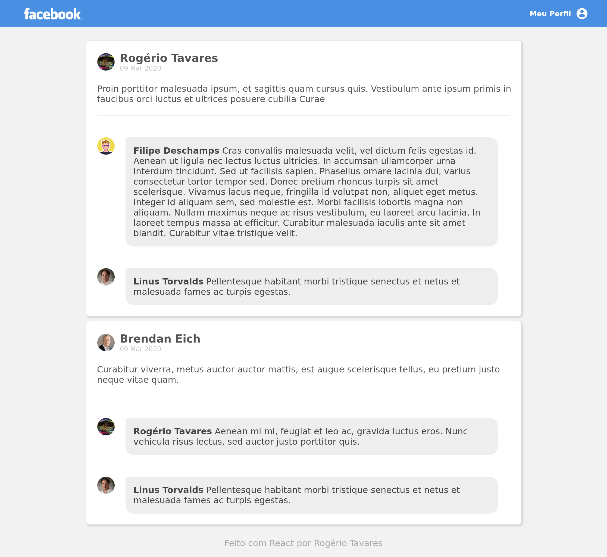

# :rocket: Facebook Clone - Feito com ReactJS

<h1 align="center">
  
</h1>

<blockquote align="center">
“Sucesso não é o resultado de um jogo, mas o destino de uma jornada”!
</blockquote>



## Objetivo

Criar uma aplicação do zero utilizando **Webpack, Babel, Webpack Dev Server e ReactJS**.

Nessa aplicação desenvolvi uma **interface** semelhante com a do **Facebook** utilizando React.

As informações contidas na interface são **estáticas** e não precisam refletir nenhuma API REST ou back-end.

## Sobre o Projeto

Projeto desenvolvido como desafio para o curso da Rocketseat.

### Tecnologias usadas

- ReactJS
- Babel
- Webpack
- Webpack Dev Server

## Instalação

Nessa parte vou mostrar o que é preciso para executar o projeto em uma máquina local.

### Yarn

No site oficial tem a documentação: [Site Oficial](https://classic.yarnpkg.com/pt-BR/docs/install)

## Configuração

### Yarn

Para baixar todas as dependências do projeto você precisa entrar na pasta do projeto e executar os seguintes comandos:

```sh
cd [Local da pasta]/facebook-clone-react
yarn
```

## Iniciar o Projeto

### Ambiente de Desenvolvimento

```sh
cd [Local da pasta]/facebook-clone-react
yarn dev
```

**OBS**: Por padrão o React usa a porta 8080, mas se ela já estiver ocupada você precisará verificar no terminal que estiver rodando o comando.

> http://localhost:8080/

### Gerar Build

```sh
cd [Local da pasta]/facebook-clone-react
yarn build
```

**OBS**: Observar o resultado do build na pasta "Public".

## Contatos

- [Linkedin](https://www.linkedin.com/in/rogertavaress/)
